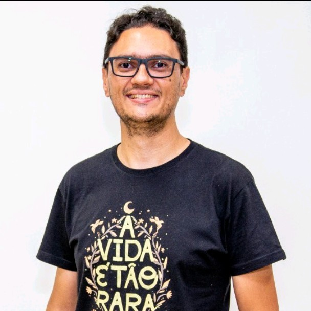

# Hamburgueria

## SOBRE

Este projeto se refere a um trabalho da faculdade que tem o objetivo de representar um CRUD de pedidos de uma hamburgueria, sendo uma aplicação apenas Front-End.

## TECNOLOGIAS

- CSS
- HTML
- JavaScript

## COLABORADORES

 </img> 
 <a href="https://www.linkedin.com/in/vitor-hugo-vieira-de-lima/" style="font-size: 20px">Vitor Hugo Vieira</a> 

#
 </img> 
 <a href="https://www.linkedin.com/in/heitor-gomes-hrecek-372242272/?originalSubdomain=br" style="font-size: 20px">Heitor Gomes Hrecek</a> 

#
</img> 
 <a href="https://www.linkedin.com/in/andré-g-oliveira-b41a1a250/" style="font-size: 20px">André Gustavo Oliveira</a> 

#
</img> 
 <a href="https://www.linkedin.com/in/joão-crestani-242175272/" style="font-size: 20px">João Crestani</a> 

#
</img> 
 <a href="https://www.linkedin.com/in/gustavo-nakamura/" style="font-size: 20px">Gustavo Nakamura Cardoso</a> 

#
</img> 
 <a href="https://www.linkedin.com/in/daniel-rinaldi-272907246/" style="font-size: 20px">Daniel Rinaldi</a> 

## PROFESSOR RESPONSÁVEL
</img> 
 <a href="https://www.linkedin.com/in/henrique-rocha-almeida/" style="font-size: 20px">Henrique Rocha Almeida</a>
